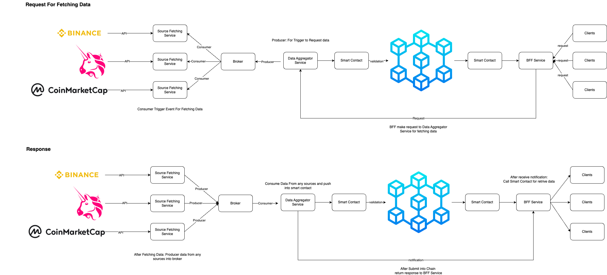

# High Level Architecture Design





## Components

### 1. Source Fetching Service

- Function: Fetches cryptocurrency prices from various sources via API.
- Queue Producer: Sends data into the Data Aggregator Service.
- Consumer: Retrieves triggers from the Data Aggregator to fetch data and sends it into the Broker.

### 2. Broker

- Function: Manages topics for triggering data requests and polling data from various sources.


### 3. Data Aggregator Service

- Function: Retrive fetching request from BFF service and polling data from multiple data sources.
- Queue Producer: Sends triggers to request data from multiple sources.
- Consumer: Retrieves fetched data from the Broker and sends it to the smart contract for chain validation and submission.

### 4. Smart Contract
- Function: Connects with the blockchain to validate and submit data.

### 5. BFF (Backend for Frontend) Service
- Function: Interfaces with clients (Web, Mobile App, etc.) for user interaction and display.


## Workflow Mechanisim for fethcing data from multi-data source

1. Client Request: The client sends an API request to the BFF service.

2. BFF to Data Aggregator: BFF forwards the request to the Data Aggregator.

3. Trigger Source Fetching: The Data Aggregator produces a message to trigger all Source Fetching Services to poll data from multiple sources.

4. Data Polling and Submission: Source Fetching Services poll data from sources and produce the data to the Broker.
The Data Aggregator consumes data from the Broker and submits it to the smart contract for chain validation and submission.

5. Response Handling: After the data is successfully submitted to the chain, the Data Aggregator returns a response to the BFF.
The BFF then connects to the smart contract to retrieve data from the chain and returns it to the client.


## Challenges and Considerations

### 1. Data Accuracy and Consistency 
- Ensuring that the data fetched from various sources is accurate and consistent is critical. Different exchanges and aggregators might provide slightly different prices due to latency, order book differences, and market dynamics.

### 2. Error Handling and Resilience
- Retry Mechanisms: Implement automatic retries for transient errors such as network issues or temporary unavailability of a data source.
- Fallback Strategies: Design fallback mechanisms to switch to alternative sources if the primary source fails.
- Graceful Degradation: Ensure that the system can degrade gracefully, providing the best possible data even if some sources are unavailable.

### 3. Latency and Performance
- Efficient Data Fetching: Optimize the Source Fetching Service for minimal latency. This could involve parallel requests, caching frequent queries, and optimizing API usage.
- Scalable Infrastructure: Ensure that the system infrastructure can scale to handle high volumes of requests from multiple clients without degrading performance.
- Load Balancing: Use load balancers to distribute incoming requests evenly across servers, preventing any single server from becoming a bottleneck.

    For this topic, Designing an infrastructure by using microservices and using tools that support the design of microservice-oriented systems, such as Kubernetes, is the key to building an infrastructure that can help in performanace issue.

### 4. Security and Data Integrity

- Secure APIs: Use secure APIs (HTTPS) for all external and internal communications to protect data in transit.
- Authentication and Authorization: Implement robust authentication and authorization mechanisms to ensure that only authorized clients and services can interact with the system.
- Data Encryption: Encrypt sensitive data both in transit and at rest to protect against unauthorized access and tampering.
- Blockchain Integration: Ensure the smart contract interactions are secure and validated. Use cryptographic methods to verify data before submission to the blockchain.

## Error Handling and Resilience Strategies

### 1. Retries and Fallbacks
From my design, the Source Fetching Service plays a crucial role in fetching cryptocurrency prices from various sources. To enhance reliability, the following mechanisms can be implemented:
- Retry Logic within Source Fetching Service: Each Source Fetching Service should include logic to retry data fetching requests if they fail initially. This is particularly important for transient network issues or temporary unavailability of the API endpoints. Exponential backoff strategies can be used to avoid overwhelming the data sources with repeated requests.

Each Source Fetching Service polls data from multiple cryptocurrency price sources. Implement retries within these services to handle transient errors. If the primary data source is unavailable, fallback to secondary sources based on a prioritized list.

```go
func fetchDataWithRetries(apiURL string, maxRetries int, backoffFactor time.Duration) (map[string]interface{}, error) {
	var data map[string]interface{}
	var err error

	for retries := 0; retries < maxRetries; retries++ {
		resp, httpErr := http.Get(apiURL)
		if httpErr != nil {
			err = httpErr
			time.Sleep(backoffFactor * (1 << retries)) // Exponential backoff
			continue
		}

		defer resp.Body.Close()

		if resp.StatusCode == http.StatusOK {
			body, readErr := ioutil.ReadAll(resp.Body)
			if readErr != nil {
				err = readErr
				time.Sleep(backoffFactor * (1 << retries))
				continue
			}

			if jsonErr := json.Unmarshal(body, &data); jsonErr != nil {
				err = jsonErr
				time.Sleep(backoffFactor * (1 << retries))
				continue
			}

			return data, nil
		}

		err = errors.New("non-200 status code received")
		time.Sleep(backoffFactor * (1 << retries))
	}

	return nil, errors.New("max retries reached, data fetch failed")
}
```

### 2. Using Fallback Sources if Primary Sources are Unavailable
- Prioritized Source List: The Source Fetching Service should maintain a prioritized list of data sources. If a primary source fails after multiple retries, the service can switch to the next available source in the list. This ensures that the system can still provide data even if some sources are down.
```go
func fetchDataFromSources(sources []string, maxRetries int, backoffFactor time.Duration) (map[string]interface{}, error) {
	var data map[string]interface{}
	var err error

	for _, source := range sources {
		data, err = fetchDataWithRetries(source, maxRetries, backoffFactor)
		if err == nil {
			return data, nil
		}
		// Optionally, log or print the error for debugging purposes
		fmt.Printf("Failed to fetch from source %s: %v\n", source, err)
	}

	return nil, errors.New("all data sources failed")
}
```

### 3. Fault Tolerance
Ensuring the Broker and Queue Systems are Fault-Tolerant:

The Broker and queue systems are essential for managing data flow and ensuring reliability. Here’s how to enhance their fault tolerance:

- Distributed Broker System: Use a distributed message broker system like Apache Kafka or RabbitMQ, which supports clustering and replication. This ensures that if one broker instance fails, another can take over seamlessly without data loss.

- Durable Queues: Configure the queues to be durable. This means that messages are stored persistently on disk and are not lost even if the broker restarts. This is crucial for maintaining data integrity and reliability.

### 4. Using Redundant Data Sources to Ensure Continuous Data Availability
To mitigate the risk of data source failure, redundancy is key:
- Multiple Source Fetching Services: Deploy multiple instances of the Source Fetching Service, each configured to fetch data from different sets of sources. This ensures that even if some services or sources fail, others can continue to provide data.

- Load Balancing: Implement load balancing across multiple Source Fetching Service instances to distribute the data fetching workload evenly. This improves system resilience and performance.

### 5. Monitoring and Alerts
- Metrics Collection: Use monitoring tools (e.g., Prometheus, Grafana, or AWS CloudWatch) to collect and visualize metrics related to API response times, success/failure rates, and system load. This helps in identifying issues early and maintaining performance standards.

- Health Checks: Implement regular health checks for all critical components, including Source Fetching Services, Brokers, and Data Aggregator Services. This ensures that any failures are detected promptly.

- Alerting Rules: Define alerting rules in our monitoring tool to notify the engineering team of critical issues such as high failure rates, unexpected latency, or data inconsistencies. For example, set thresholds for acceptable API failure rates and trigger alerts if these are exceeded.

- Notification Channels: Configure multiple notification channels (e.g., email, Slack, PagerDuty) to ensure that alerts reach the responsible teams quickly. This enables rapid response and mitigation of issues.

Applying by 

- Source Fetching Services: Monitor API response times, success rates, and latency.
- Broker: Monitor message throughput, queue lengths, and broker health.
- Data Aggregator Service: Monitor data processing times, success rates, and integration with smart contracts.


## Documentation Approach
### 1. For Internal Engineering Teams:

- Detailed technical documentation of system architecture, components, and interactions.
- API documentation for internal services.
- Operational guidelines for monitoring, error handling, and maintenance.

### 2. For Clients:

- API documentation for querying and submitting data.
- User guides for interacting with the BFF service.
- FAQ and troubleshooting guides for common issues.